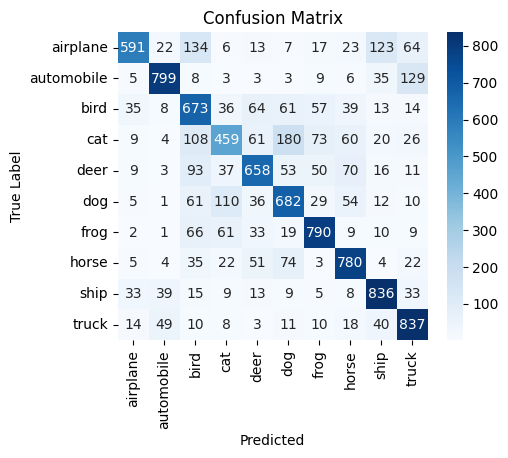
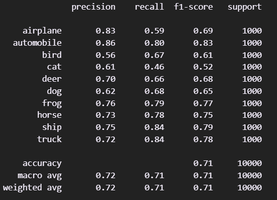

# Object Recognition
Proyek klasifikasi gambar menggunakan CNN pada dataset CIFAR-10.

## Deskripsi
Kode ini merupakan aplikasi percobaan klasifikasi objek gambar menggunakan dataset CIFAR-10. Tujuan dari proyek ini adalah untuk mengklasifikasikan gambar ke dalam salah satu dari 10 kategori objek menggunakan model Convolutional Neural Network (CNN) dengan arsitektur yang sederhana.

## Load Dataset
- URL Dataset: `https://www.cs.toronto.edu/~kriz/cifar.html`

## Label
- [`airplane, automobile, bird, cat, deer, dog, frog, horse, ship, truck`]

## Akurasi dan Evaluasi
Berikut adalah hasil evaluasi model, termasuk nilai akurasi, confusion matrix, dan F1-score yang diperoleh setelah pelatihan:

### Akurasi
Berikut adalah grafik yang menunjukkan akurasi model pada data training dan testing:

### Confusion Matrix
Confusion matrix untuk evaluasi model, yang menunjukkan kinerja model dalam mengklasifikasikan gambar berdasarkan label yang benar dan salah:

### F1-Score
F1-score yang diperoleh untuk setiap kelas:

## Testing
- Dapat mengggunakan gambar yang telah disediakan di folder `test_image` maupun gambar lain.

## Run app
- Buka `app.py`, lalu buka terminal dan ketik `streamlit run app.py` untuk menjalankan aplikasi.
