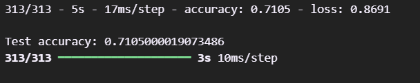

# ObjectRecognition-cnn
Proyek klasifikasi gambar menggunakan CNN pada dataset CIFAR-10.

## Deskripsi
Kode ini merupakan aplikasi percobaan klasifikasi objek gambar menggunakan dataset CIFAR-10. Tujuan dari proyek ini adalah untuk mengklasifikasikan gambar ke dalam salah satu dari 10 kategori objek menggunakan model Convolutional Neural Network (CNN) dengan arsitektur yang sederhana. Model ini diharapkan dapat mencapai akurasi yang baik dalam mengklasifikasikan gambar.

## Akurasi dan Evaluasi
Berikut adalah hasil evaluasi model, termasuk nilai akurasi, confusion matrix, dan F1-score yang diperoleh setelah pelatihan:

### Akurasi
Berikut adalah grafik yang menunjukkan akurasi model pada data training dan testing:

### F1-Score
F1-score yang diperoleh untuk setiap kelas:

### Confusion Matrix
Confusion matrix untuk evaluasi model, yang menunjukkan kinerja model dalam mengklasifikasikan gambar berdasarkan label yang benar dan salah:

## Run app
- Buka app.py, lalu buka terminal dan ketik `streamlit run app.py` untuk menjalankan aplikasi.
